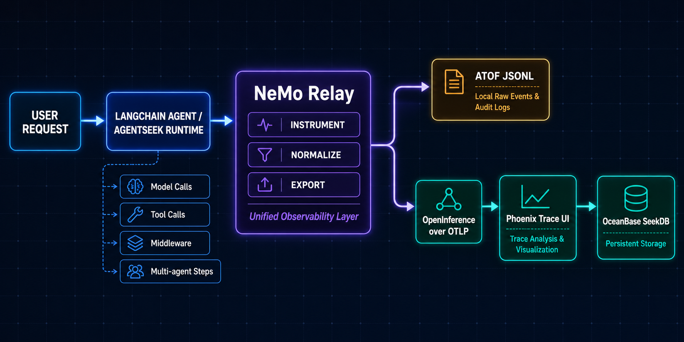
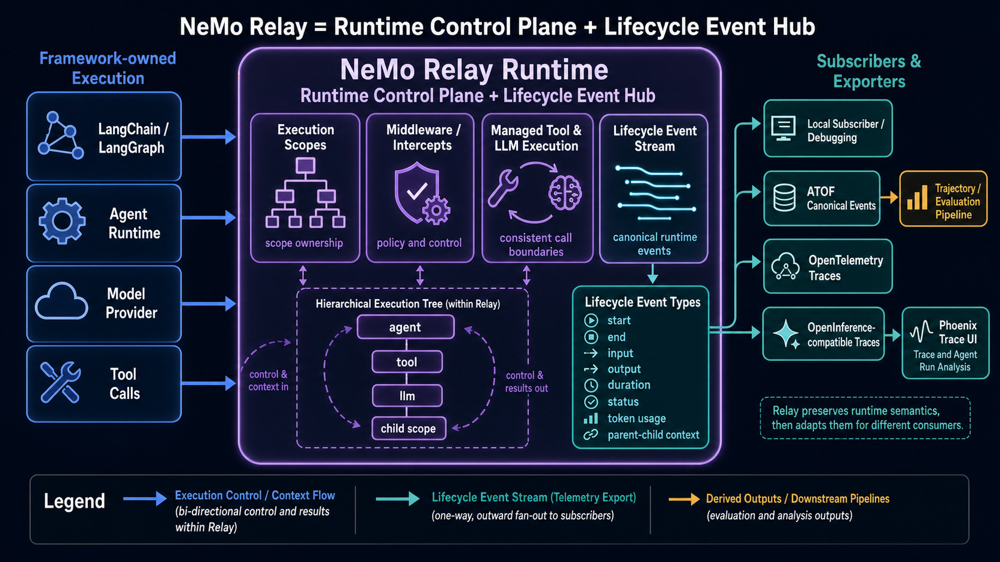

# LangChain Relay Observability

LangChain `create_agent` + CopilotKit + Bub/AG-UI with NeMo Relay, bounded Tavily research tools, Phoenix, and OceanBase SeekDB.

## Why this template promotes NeMo Relay

An agent can return the right final answer while still being difficult to operate: a tool may have been called with the wrong arguments, a model may have taken an unexpected branch, or latency and token usage may have increased without an obvious error. NeMo Relay provides the observability layer that turns those hidden agent steps into structured events and traces.

Relay is not another chat UI and it is not the Phoenix database. It sits beside the application, instruments the agent execution, and can send the same run to multiple sinks. This template enables two sinks:

- ATOF JSONL: a local, append-only audit/debug archive for inspecting the raw event stream.
- OpenInference over OTLP: a standard trace export for Phoenix, where spans can be searched and visualized.

Phoenix is the developer-facing trace UI and persistence service. The relationship is:

```text
LangChain agent → NeMo Relay (instrument + normalize + fan out)
                         ├─ ATOF JSONL (local raw events)
                         └─ OpenInference / OTLP → Phoenix → SeekDB
```

### Observability architecture



### NeMo Relay runtime role



Use Relay when you need consistent visibility across model calls, tool calls, middleware, and multi-agent steps; use Phoenix to inspect that data during development and operations. Keeping these roles separate also lets you retain a local raw archive without running Phoenix, or replace the trace backend later without rewriting the agent.

This template is based on `langchain/default`; it preserves the default middleware and frontend lifecycle. Relay is the only observability chain. Verified dependencies: `nemo-relay==0.6.0`, `tavily-python==0.7.27`, and `markdownify==1.2.3`.

Create it with Cookiecutter, copy `.env.example` to `.env`, set `BUB_API_KEY` and the required `TAVILY_API_KEY`, then run `agentseek dev`. The first start downloads Python/Node dependencies and Phoenix/SeekDB images and may take several minutes.

See the generated project's README for the full architecture, privacy, troubleshooting, and persistence guide.
